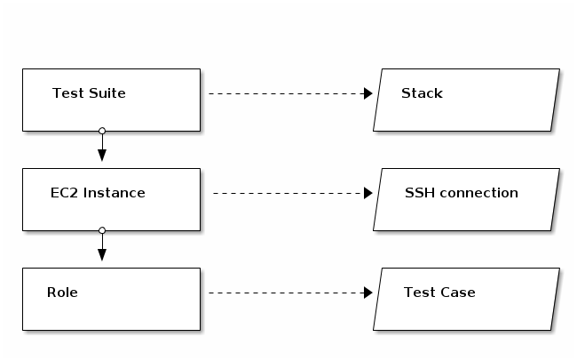

# aws-must-templates - cloudformation templates for aws-must - $Release:0.2.4-SNAPSHOT$

Set of [extensible](#OVERRIDE)
[templates](https://rawgit.com/jarjuk/aws-must-templates/master/generated-docs/aws-must-templates.html)
for [aws-must](https://github.com/jarjuk/aws-must) tool to generate
CloudFormation JSON from a YAML configuration, and a
[Test Runner](#TESTING) with
[reusable tests](https://rawgit.com/jarjuk/aws-must-templates/master/generated-docs/aws-must-templates-spec.html)
for [validating correctness](#TEST_CASES) of CloudFormation stacks
provisioned.

See blog posts
[part1](https://jarjuk.wordpress.com/2015/08/18/announcing-aws-must-templates-part1)
and
[part2](https://jarjuk.wordpress.com/2015/09/01/announcing-aws-must-templates-part2)
for background information on this tool.

## The Problem

When using code generators, consider

1.  Code generators are much like a "Garden Party": Most of the things
    that you need may be there, but some specific feature is quite
    likely to be missing, or should be implemented in a different way.
    "When you can't please everyone, you got to please yourself" - and
    use the possibility to modify template generation process to meet
    your own needs.

2.  You can't say that a "Day is Done" just by having an
    implementation. Implementation without validating correctness is
    asking for trouble.

3.  Avoid "Vanishing Mind" syndrome in testing, i.e.  failing to reuse
    existing tests.  After all, we are relying on a generator, which
    is hopefully comprehensively tested. The test mechanism and test
    suites should be available also for template generator users.
  
4. When reusing tests: "Do You Remember"/"It All Starts With One": the
   tests that come along with the generator should also be open for
   extensions.

## The solution

**aws-must-templates** tries to address the above listed considerations

1. by allowing users to [extend](#OVERRIDE) template generation
   process

2. by including a [configurable](#TEST-SUITES) [test runner](#TESTING) to lower
   the threshold to write tests

3. by allowing users [to reuse](#TEST_CASES)
   [test cases](https://rawgit.com/jarjuk/aws-must-templates/master/generated-docs/aws-must-templates-spec.html)
   from **aws-must-templates** quality assurance

4. by having the possibility to [include own test](#TEST_CASES)
   cases to test suites

## Usage

### Installation

Add the following lines to `Gemfile`

    source 'https://rubygems.org'
	gem 'aws-must-templates'
	
and run

	bundle install
	
**Notice**: requires Ruby version ~> 2.0.

### Configuration

Create a YAML configuration for a CloudFormation stack using
attributes referenced by
[aws-must-templates](https://rawgit.com/jarjuk/aws-must-templates/master/generated-docs/aws-must-templates.html).

For a configuration walk trough see blog post
[Announcing aws-must-templates - part 1](https://jarjuk.wordpress.com/2015/08/18/announcing-aws-must-templates-part1)

The easiest way to start, is to take a look at YAML configurations
used to validate **aws-must-templates** implementation. For, example

* [smoke.yaml](smoke.yaml): creates a S3 bucket

* [suite1.yaml](suite1.yaml): creates two EC2 instances, and one S3
  bucket, one of the instances (`myInstance`) which is granted a read
  access to the S3 bucket
  
* [suite2.yaml](suite2.yaml): Creates VPC with Public and Private
         Subnets (NAT) similar to
         [scenario 2](http://docs.aws.amazon.com/AmazonVPC/latest/UserGuide/VPC_Scenario2.html)
  
See [test report](https://gist.github.com/jarjuk/9ab1c25d436c4e468f5e)
of **aws-must-templates** for more information.

### Generate CloudFormation JSON templates

Assuming a YAML stack configuration in a file `mystack.yaml`, the
command

	bundle exec	aws-must.rb gen mystack.yaml  -m aws-must-templates 
	
prints the generated CloudFromation JSON template to STDOUT.

### Overriding template implementation<a id="OVERRIDE"/>

For a better match of a particular need, user may modify template
generation by overriding
[templates](https://rawgit.com/jarjuk/aws-must-templates/master/generated-docs/aws-must-templates.html)
in **aws-must-templates** with own implementations.

For example, the default
[AIM mapping table](https://rawgit.com/jarjuk/aws-must-templates/master/generated-docs/aws-must-templates.html#mappings.mustache)
in **aws-must-templates** supports only `t2.micro` instance type for
type Ubuntu 14.04 LTS Trusty operating system version.

Saving the following template in `myextensions/mappings.mustache`

     {{!
     +++start+++
	 
     Use Ubuntu `utopic` v. 14.10 for `t2.micro` `instanceType`.
	 
     +++close+++
     }}
     
     {{! +++fold-on+++ }}
     
           "AWSInstanceType2Arch" : {
           "t2.micro"    : { "Arch" : "64" }
           },
           "AWSRegionArch2AMI" : {
                "ap-northeast-1" : { "64" : "ami-50c27450" },
                "ap-southeast-1" : { "64" : "ami-8ae3e1d8" },
                "ap-southeast-2" : { "64" : "ami-25eea81f" },
                "cn-north-1" : { "64" : "ami-9671ecaf" },
                "eu-central-1" : { "64" : "ami-84333699" },
                "eu-west-1" : { "64" : "ami-b4a5eec3" },
                "sa-east-1" : { "64" : "ami-0f199612" },
                "us-east-1" : { "64" : "ami-d36cb0b8" },
                "us-west-1" : { "64" : "ami-33fc9c10" },
                "us-gov-west-1" : { "64" : "ami-77887533" },
                "us-west-2" : { "64" : "ami-dd353aed" }
           }
     
     {{! +++fold-off+++ }}

and issuing the command

	bundle exec	aws-must.rb gen mystack.yaml  -m myextensions/ aws-must-templates
	
uses Ubuntu `utopic` v. 14.10 for `t2.micro` instance types.

**NOTICE**: In `-m` option, directory names need to end with slash
  character to distinguish them from Gem names.

### Provision the stack on Amazon platform <a id="PROVISION"/>

**WARNING** Provisioning CloudFormation templates on Amazon will be
**charged according to Amazon pricing policies**.

Assuming that [Aws Command Line Utility](https://aws.amazon.com/cli)
is installed and
[setup correctly](http://docs.aws.amazon.com/cli/latest/userguide/cli-chap-getting-set-up.html),
the command

	aws cloudformation create-stack --stack-name mystack  --capabilities CAPABILITY_IAM  --template-body "$(bundle exec	aws-must.rb gen mystack.yaml  -m myextensions/ aws-must-templates)"  --disable-rollback

provisions stack `mystack` from YAML configuration in `mystack.yaml`.
Templates in `myextensions` directory override default implementations
in **aws-must-templates** Gem.

## Testing CloudFormation stacks using **aws-must-templates** Test Runner<a id="TESTING"/>

CloudFormation stacks can be tested using Test Runner that comes along
with **aws-must-templates** Gem.

To use the **aws-must-templates** Test Runner

* [setup for Test Runner](#SETUP-TEST-RUNNER)
* [prepare Test Context](#TEST-CONTEXT)
* [implement Test Cases](#TEST_CASES)
* [configure Test Suites](#TEST-SUITES) in `test-suites.yaml` -file
* [run tests](#RUN-TESTS)

### Setup for Test Runner<a id="SETUP-TEST-RUNNER"/>

Add following lines to `Rakefile`

    # name of configuration file
    suite_runner_configs= "suite-runner-configs.yaml"

    # Override configuration in 'suite.rake' 
    $suite_runner_configs = File.exist?(suite_runner_configs) ? YAML.load_file( suite_runner_configs ) : {}

	spec = Gem::Specification.find_by_name 'aws-must-templates'
	load "#{spec.gem_dir}/lib/tasks/suite.rake"
	
Optionally, copy
[default Test Runner Configurations](https://rawgit.com/jarjuk/aws-must-templates/master/suite-runner-configs.yaml)
to `suite-runner-configs.yaml` file in current working directory, and
modify settings in the file to override default values.
	
Create an empty `test-suites.yaml`	 -file

	touch test-suites.yaml

and run 	

	rake -T suite
	
For an empty `test-suites.yaml`, the result shows

	rake suite:all[gen_opts]  # Run all suites

### Prepare Test Context <a id="TEST-CONTEXT"/>

Preparing Test Context includes

* Setting up AWS Account 
* Preparing ssh-connection configuration

**Setup AWS Account**

In order to access an EC2 instances, to AWS needs to have a valid key
pair
[imported](http://docs.aws.amazon.com/AWSEC2/latest/UserGuide/ec2-key-pairs.html#how-to-generate-your-own-key-and-import-it-to-aws).

**Prepare ssh-connection configuration**

Test Runner uses
[SSH Client Configuration](http://www.openbsd.org/cgi-bin/man.cgi/OpenBSD-current/man5/ssh_config.5?query=ssh_config&sec=5)
in `ssh/config.aws` file. Configuration file `ssh/config.aws` is
created automatically, using `ssh/config.init`, if it does not exist.

For example, the following configuration in `ssh/config.init`
instructs OpenSSH 

    Host *.internal
        ProxyCommand ssh myFront1 -F ssh/config.aws nc -q0 %h 22

    # using RHEL Amazon vpc-nat instance --> ec2-user
    Host myNat
         user ec2-user

    Host *
        user ubuntu
        StrictHostKeyChecking no
        UserKnownHostsFile=/dev/null
        IdentityFile ~/.ssh/demo-key/demo-key
		
		
* to use user name `ubuntu` and SSH private key in
  `~/.ssh/demo-key/demo-key` for all hosts, expect for instance
  `myNat` user name is `ec2-user`. 
  
* to proxy connections to host names ending `.internal` to proxy
  connections over instance `myFront1`

* to prevent OpenSSH from updating your default `.ssh/known_hosts`
  file with the fingerprint of the (temporary) instance used in
  testing.

Once configuration in `ssh/config.init` is in place, running

	rake suite:ec2-sync

updates EC2 instance metadata in `ssh/config.aws`.
	
**Notice** You may need to change `aws_region` setting values in
[suite-runner-configs.yaml](#SETUP-TEST-RUNNER).

See
[blog post](https://jarjuk.wordpress.com/2015/09/08/using-openssh-on-aws-platform/#more-273https://jarjuk.wordpress.com/2015/09/08/using-openssh-on-aws-platform)
for more information on using OpenSSH on AWS platform.

### Implement Test Cases<a id="TEST_CASES"/>

Test Runner allows user to implement own Test Cases, or to
[reuse](https://rawgit.com/jarjuk/aws-must-templates/master/generated-docs/aws-must-templates-spec.html)
existing tests in **aws-must-templates**.  It first searches Test
Cases locally under sub-directory `spec/aws-must-templates`, and if
not found, tries to locate Test Cases in Gem **aws-must-templates**.

Test runner uses Rspec with [serverspec](http://serverspec.org/)
library.  For example, `ValidOSVersion` Test Case in
**aws-must-templates**, validates operating system version
with the code shown:

    require 'spec_helper'
    
    current_test = "ValidOSVersion"
    
    describe current_test do
    
      # parameter 'Codename' defined in test-suites.yaml
      codename = test_parameter( current_test, "Codename" )
    
      describe "Operating system codename '#{codename.value}'" do
        describe command('lsb_release --c -s') do
          its( :stdout ) { should match /#{codename.value}/ }
        end
      end
    end

For more information on Test Cases, see
[test report](https://gist.github.com/jarjuk/9ab1c25d436c4e468f5e)
generated, when running [test-suites](test-suites.yaml) in
**aws-must-templates** development.

### Configure Test Suites <a id="TEST-SUITES"/>

Test Suites are configured in `test-suites.yaml`. Test Runner searches
this file in current working directory.

The picture below present main elements used in `test-suites.yaml`.

A Test Suite validates correctness of a CloudFormation Stack. One Test
Suite defines tests for multiple EC2 Instances. SSH Client
Configuration for a EC2 Instance is looked up in
[ssh/config.aws](#TEST-CONTEXT) -file. An EC2 Instance acts in many
Roles. A Role maps to a [Test Case](#TEST_CASES), and defines values
for the Test Case Parameters. The parameter may be a constant, or a
reference to Stack Parameter, or to Stack Output.

As an example, the Test Suite for `mystack` is 

    - mystack:
       desc: Copy of suite1 EC2 instance with s3 access
       instances:
         - myInstance:
             roles:
               - ValidOSVersion:
                    Codename: utopic
              - S3ReadAccessAllowed:
                    Bucket: "@Outputs.Bucket"

The Suite validates stack `mystack` by running two Test Cases
`ValidOSVersion` and `S3ReadAccessAllowed` on EC2 instance
`myInstance`.

Test Case `ValidOSVersion` was presented [earlier](#TEST_CASES). It
uses parameter `Codename` to validate operating system version. In
this configuration, the parameter value is constant
`utopic`. Effectively this validates that CloudFormation mapping used
to [override](#OVERRIDE) the default implementation in
**aws-must-templates** is successfully provisioned.

Test Case `S3ReadAccessAllowed` is passed a parameter, which gets its
value from stack output variable `Bucket`.

See [test-suites.yaml](test-suites.yaml) in **aws-must-templates** for
a more detailed explanation, and for more examples.

### Running test suites <a id="RUN-TESTS"/>

**WARNING** Running tests provisions Amazon platform, and will be
**charged according to Amazon pricing policies**.

**NOTICE** It advisable to check on AWS console that all stack
  resources are deleted successfully after running test suites.
  
**Notice** Some of tests included in **aws-must-templates** use AWS
  [SDK for Ruby - Version 2](http://docs.aws.amazon.com/sdkforruby/api/index.html). The
  SDK searches `ENV['AWS_REGION']` for a region information. You have
  the option to set the environment variable, or configure property
  `aws_region` in [suite-runner-configs.yaml](#SETUP-TEST-RUNNER).
  

To run test suite `mystack` defined in in `test-suites.yml` using
default templates in **aws-must-templates** use the command

    rake suite:mystack
	
To [override](#OVERRIDE) default implementation with templates in
directory `myextensions`, use the command

	rake suite:mystack['-m myextensions/ aws-must-templates']

For a Test Suite, Test Runner

* generates a CloudFormation JSON template, 
* uses the JSON template to provision a stack on Amazon platform, 
* and, once the `StackStatus` is `CREATE_COMPLETE`, 
* iterates EC2 Instances and runs Test Cases in the EC2 Instance Role
* creates test reports to `generated-doc/suites` directory
* finally, after the test execution, the stack is deleted from Amazon platform.

To run all test suites defined in `test-suites.yaml`, use the command

	rake suite:all
	
or to override the default implementation

	rake suite:all['-m myextensions/ aws-must-templates']

Command

	rake -T suite 
	
list of tasks `rake suite:all` uses for implementation.

## Development

See [DEVELOPMENT](DEVELOPMENT.md)

## Changes

See [RELEASES](RELEASES.md)

## TODO

Add more tests, e.g.

* SNS
* install Chef

Add more template support

* support for SNS notifications

Better documentation

* use RDoc to document Test Cases

## License 

MIT

